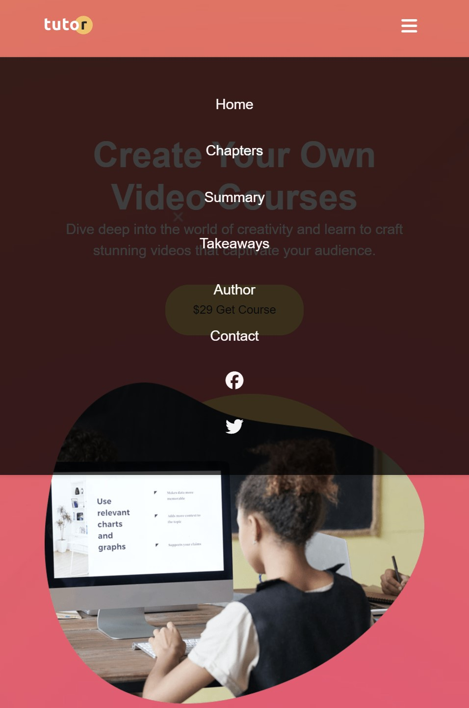

# Tutor - Web site

This the resulting Web Application from Traversy Media course HTML & CSS, Tutor project.

The purpose with the website is to sell a course on creating video courses

### Summary

The Web Application consists of a main page and a details page.
Both pages use same Navbar, Footer.

The main page include the following:

- Hero section
- Learn section, what will you learn
- Course overview section
- Course summary section
- Info section, who this course is for
- Takeaways section
- Course Details section
- Author info section
- Subscribe section
- Contact Us section

The Contact Us page include the following:

- Contact Form

The Web Application is built with HTML, CSS and a little Javascript for handling mobile menu and modal. Flexbox is used in different sections

The Web application is 1200px wide and have media queries 992px and 768px (mobile)

### Screenshot of desktop view

### Screenshot of mobile view

### Screenshot of mobile view, Key Takeaways

### Link to Tutor Website

https://tutor-website-lt0ynx2zh-peters-projects-b4f9dabf.vercel.app/

## Author

Peter Welliver
